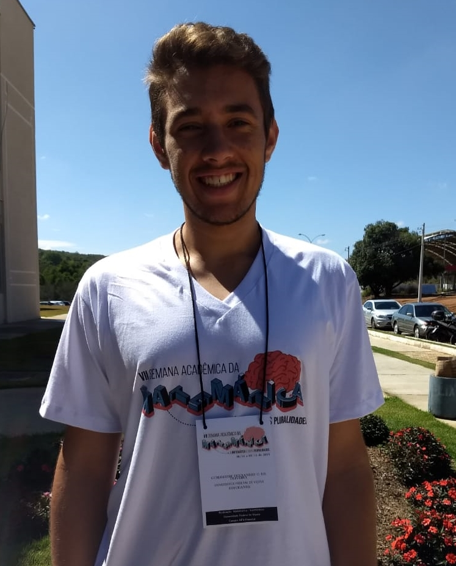

```{r, include=FALSE}
xaringanExtra::use_webcam ()
```
```{r, include=FALSE}
library(tidyverse)
library(knitr)
library(emo)
library(data.table)
```
```{r xaringan-panelset, echo=FALSE}
xaringanExtra::use_panelset()
```
```{r, include=FALSE}
# df <- fread("data/caso.csv",
#             encoding = "UTF-8")
# 
# dfCity <- df %>%
#           filter(place_type == "city") %>% 
#           arrange(city)
# 
# 
# dfState <- df %>%
#           filter(place_type == "state") %>% 
#           arrange(state)
# 
# dfStateLast <- dfState %>% 
#   filter(is_last == TRUE)
```

class: center, middle

```{r qrcode, echo=FALSE, out.width='30%'}

```
</div>
.center[
[guilhermefco.github.io/reuniaoMineira2021/](guilhermefco.github.io/reuniaoMineira2021/)
]

---
### Orientação

.center[
Professor Doutor Fernando de Souza Bastos
]
.center[
```{r fernando, echo=FALSE, out.width='25%'}
knitr::include_graphics('img/fernando.gif')
```
]
.center[
<a href="https://www.linkedin.com/in/fsbmat/"><i class="fab fa-linkedin" style="font-size:40px;"></i></a>
<a href="https://github.com/fsbmat-ufv"><i class="fab fa-github" style="font-size:40px;"></i></a>
<a href="https://fsbmat-ufv.github.io/"><i class="fas fa-globe" style="font-size:40px;"></i></a>
]

### Apoio

.center[
```{r cnpq, echo=FALSE, out.width='50%'}
knitr::include_graphics('img/pibic_cnpq.jpg')
```
]

---
# Covid-19 (SARS-CoV-2)

.center[
```{r sarsCoV2, echo=FALSE, out.width='60%'}
knitr::include_graphics('img/sarsCoV2.jpg')
```
]

**Fonte:** [Journal of Medical Virology](https://onlinelibrary.wiley.com/doi/full/10.1002/jmv.25685)

---
# Covid-19 (SARS-CoV-2)

<h3>Sintomas</h3>

- Febre
  
- Tosse seca
  
- Cansaço

- Dificuldade de respirar
  
- Outros sintomas menos comuns:
  
  * Perda de paladar ou olfato
    
  * Dor de cabeça
    
  * Dor de garganta

**Fonte:** [OMS](https://www.who.int/emergencies/diseases/novel-coronavirus-2019/advice-for-public)

---
# Covid-19 (SARS-CoV-2)

<h3>Transmissão</h3>


- .justify[
A transmissão ocorre pelo ar, ou por contato pessoal, através de secreções contaminadas.
]
 
- .justify[
Devido ao modo de transmissão vários lugares do mundo decretaram isolamento social visto que até o momento não há medicamento para o combate e enfrentamento da doença.
]
  
**Fonte:** [OMS](https://www.who.int/news-room/q-a-detail/coronavirus-disease-covid-19-how-is-it-transmitted#:~:text=COVID%2D19%20is%20caused%20by,speak%2C%20sing%20or%20breathe%20heavily.)

---
class: middle, center, inverse

# Dados

---
class: center, middle

# Agradecimentos

---
# Redes Sociais

.center[
Guilherme Fernandes Castro de Oliveira
]
.center[
``` {r eu, echo=FALSE, out.width='35%'}

```
]
.center[
<a href="https://www.linkedin.com/in/guifernandesco/"><i class="fab fa-linkedin" style="font-size:40px;"></i></a>
<a href="https://github.com/GuilhermeFCO"><i class="fab fa-github" style="font-size:40px;"></i></a>
<a href="https://www.facebook.com/guifernandesco"><i class="fab fa-facebook" style="font-size:40px;"></i></a>
<a href="https://www.instagram.com/guifernandesco/"><i class="fab fa-instagram" style="font-size:40px;"></i></a>
<a href="https://twitter.com/guifernandesco"><i class="fab fa-twitter" style="font-size:40px;"></i></a>
<a href="mailto:guilherme.f.castro@ufv.br"><i class="far fa-envelope" style="font-size:40px;"></i></i></a>
]
.center[
**E-mail:** <a href="mailto:guilherme.f.castro@ufv.br">guilherme.f.castro@ufv.br</a>
]

---
class: center, middle, inverse

# Obrigado!
